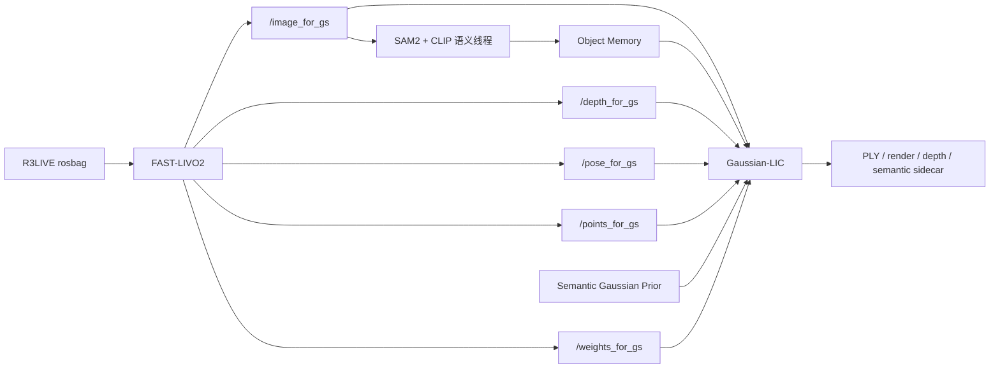

# 工程架构与实验运行指南

## 1. 文档定位

本文是当前工程唯一的架构、文件索引和运行手册。它回答：

- 每个本地/远端文件夹用于什么；
- 本项目新增或修改的关键文件实现了什么；
- 如何构建 FAST-LIVO2、Coco-LIC 和 Gaussian-LIC；
- 如何运行 baseline、Teacher、Prior、语义服务和消融；
- 结果、日志、模型和数据存在哪里；
- 如何判断一次实验有效。

数值结果不在本文重复维护，统一见 `实验记录与对比结果.md`。

## 2. 系统总览



当前主链：

```text
FAST-LIVO2
  -> backend_contract 四路观测 + 退化权重
  -> Gaussian-LIC
  -> 独立开放词汇对象语义线程
  -> Object Memory / Semantic Gaussian Prior
```

参考链：

```text
Coco-LIC -> Gaussian-LIC
```

Coco-LIC 仅用于官方基线和接口行为参照；新方法前端固定为 FAST-LIVO2。

## 3. 本地目录体系

工作区根目录：

```text
D:\aayan\research\Remote-Code
```

| 目录/文件 | 用途 | 是否主链 |
|---|---|---|
| `FAST-LIVO2/` | 当前 LIC 前端、退化检测、权重计算、3DGS 数据发布 | 是 |
| `external/Gaussian-LIC/` | 当前 3DGS 后端、语义索引、对象内存、Prior | 是 |
| `external/Coco-LIC/` | 官方参考前端，用于复现 Coco + Gaussian 基线 | 参考 |
| `external/Livox-SDK/` | Livox 驱动依赖 | 依赖 |
| `scripts/` | 跨仓库运行、轨迹评估和消融脚本 | 是 |
| `rpg_vikit/` | FAST-LIVO2 视觉工具依赖 | 依赖 |
| `Sophus/` | 李群运算依赖 | 依赖 |
| `推荐研究方向与实施方案.md` | 唯一研究主线、科学问题和实施路线 | 文档 |
| `工程架构与实验运行指南.md` | 本文，架构、文件和运行命令 | 文档 |
| `实验记录与对比结果.md` | 编号实验、结果表和有效性结论 | 文档 |
| `AGENTS.md` | Codex 项目记忆和部署约束 | 配置 |

第三方仓库原始 README 保留在各自目录，不承担本项目最新状态说明。

## 4. 远端目录体系

当前验证服务器入口会随租用实例变化。最近使用：

```bash
ssh -p 20338 root@connect.bjb1.seetacloud.com
```

每次实验前必须重新确认端口、工作区和数据，不得假设旧实例仍存在。

| 远端路径 | 用途 |
|---|---|
| `/root/autodl-tmp/FastLIVO2_ws` | FAST-LIVO2 isolated catkin 工作区 |
| `/root/autodl-tmp/catkin_gaussian` | Gaussian-LIC catkin 工作区 |
| `/root/autodl-tmp/catkin_coco` | Coco-LIC catkin 工作区 |
| `/root/autodl-tmp/datasets/r3live` | R3LIVE rosbags |
| `/root/Software/libtorch` | Gaussian-LIC 使用的官方 libtorch |
| `/root/autodl-tmp/scripts` | 远端运行脚本 |
| `/root/autodl-tmp/runtime_logs` | 每次运行日志与资源曲线 |
| `/root/autodl-fs/datasets` | 持久盘训练数据和 Teacher shards |
| `/root/autodl-fs/models` | SAM2、CLIP、Prior 等持久模型 |
| `/root/autodl-fs/experiments` | 训练 checkpoint、manifest 和评估 JSON |

存储原则：

- 系统盘只放系统、ROS 和必要软件；
- `/root/autodl-tmp` 放源码、构建产物、bag 和临时结果；
- `/root/autodl-fs` 放不可轻易重建的数据、模型和正式实验产物。

## 5. FAST-LIVO2 关键文件

### 5.1 配置与启动

| 文件 | 功能 |
|---|---|
| `FAST-LIVO2/config/r3live_hku.yaml` | R3LIVE HKU 数据集参数、话题、外参与前端参数 |
| `FAST-LIVO2/launch/mapping_r3live_hku.launch` | FAST-LIVO2 常规 R3LIVE 启动 |
| `FAST-LIVO2/launch/mapping_r3live_hku_backend_contract.launch` | 为 Gaussian-LIC 发布 K=431 去畸变针孔图像及四路后端接口 |

正确相机契约：

```text
fx=431.71205
fy=431.70855
cx=320.3404
cy=259.1696
```

### 5.2 退化检测与 3DGS 发布

| 文件 | 功能 |
|---|---|
| `FAST-LIVO2/include/voxel_map.h` | 声明局部几何退化统计和体素地图相关状态 |
| `FAST-LIVO2/src/voxel_map.cpp` | 计算局部协方差谱、有效约束和 LiDAR 几何质量 |
| `FAST-LIVO2/include/LIVMapper.h` | 声明视觉/LiDAR/IMU 退化状态、权重和 3DGS 发布接口 |
| `FAST-LIVO2/src/LIVMapper.cpp` | 生成退化指标与动态权重，发布图像、深度、位姿、点云和权重消息 |

输出主题：

```text
/image_for_gs
/depth_for_gs
/pose_for_gs
/points_for_gs
/weights_for_gs
```

### 5.3 FAST-LIVO2 脚本

| 文件 | 功能 |
|---|---|
| `degradation_score.py` | 将原始退化指标归一化并融合成视觉/LiDAR/IMU/总分 |
| `plot_degradation_scores.py` | 绘制退化分数和权重曲线 |
| `export_3dgs_frontend_packet.py` | 将前端轨迹、观测和退化状态导出为 JSONL packet |
| `replay_3dgs_frontend_packet.py` | 回放已冻结 packet，隔离前端重复运行波动 |
| `validate_3dgs_contract.py` | 校验四路消息、时间戳、维度和相机契约 |
| `open_vocab_semantic_risk_bridge.py` | 早期像素级开放语义风险桥；当前对象内存版的兼容入口 |
| `README_3dgs_frontend_packet.md` | packet 格式说明 |
| `README_fastlivo2_gaussianlic_bridge.md` | FAST-LIVO2 到 Gaussian-LIC 接口说明 |

## 6. Gaussian-LIC 关键文件

### 6.1 核心后端

| 文件 | 功能 |
|---|---|
| `src/mapping.h` | ROS mapping 节点配置、状态和回调声明 |
| `src/mapping.cpp` | 订阅四路观测/权重/语义，驱动 Gaussian 更新、评估和保存 |
| `src/gaussian.h` | Gaussian 模型、相机集、语义状态、Prior 和 Teacher 导出接口 |
| `src/gaussian.cpp` | 新增/优化/densification/pruning、动态权重、语义索引、Prior、Teacher sidecar 和画质评估 |
| `src/camera.h` | 相机内外参、图像/深度、每帧权重和训练/测试视角状态 |
| `src/tensor_utils.h` | OpenCV、Eigen、Torch tensor 转换及 NPY 写出辅助 |
| `src/loss_utils.h` | L1、PSNR、SSIM 和相关损失函数 |
| `src/optim_utils.h` | 优化器和学习率辅助 |
| `src/general_utils.h` | 数值、旋转和通用工具 |
| `src/eigen_utils.h` | Eigen 几何转换辅助 |
| `src/yaml_utils.h` | YAML 配置读取 |
| `src/depth_completer.*` | 可选深度补全；主链保持关闭 |
| `src/tinyply.*` | PLY 读写 |

### 6.2 语义消费与服务

| 文件 | 功能 |
|---|---|
| `src/semantic_bundle.h/.cpp` | 读取 clean semantic sidecar，验证点数、维度和索引 |
| `src/semantic_query_cli.cpp` | 命令行文本/特征查询 |
| `src/semantic_highlight_cli.cpp` | 将查询命中的 Gaussian 导出高亮 PLY |
| `src/semantic_query_server.cpp` | ROS 动态查询服务 |
| `srv/SemanticQuery.srv` | 查询 service 请求/响应定义 |

### 6.3 配置文件

| 文件 | 功能 |
|---|---|
| `config/r3live_paper.yaml` | K=431、Prior 关闭、100-step 正式 baseline |
| `config/r3live_prior.yaml` | K=431、Prior 开启、默认 20-step Student |
| `config/r3live_teacher.yaml` | K=431、Prior 关闭、100-step、Teacher sidecar 开启 |
| `config/fastlivo2_paper.yaml` | 旧 K≈646 契约，仅用于历史复现 |
| `config/object_memory_real_smoke.yaml` | 对象内存真实模型 smoke |
| `config/online_semantic_smoke.yaml` | 在线语义投影 smoke |
| `config/fastlivo2.yaml`、`r3live.yaml` | 上游/兼容配置，不作为论文主配置 |

### 6.4 Launch 文件

| 文件 | 功能 |
|---|---|
| `launch/r3live.launch` | 常规 R3LIVE Gaussian-LIC |
| `launch/fastlivo2.launch` | FAST-LIVO2 接口兼容启动 |
| `launch/fastlivo2_packet_bridge.launch` | 冻结 packet/bridge 启动 |
| `launch/object_semantic_memory.launch` | 对象语义内存节点 |
| `launch/semantic_query_server.launch` | 动态语义查询服务 |

### 6.5 对象语义与 Prior 脚本

| 文件 | 功能 |
|---|---|
| `object_latent_encoder.py` | 将对象状态编码为与 CLIP 解耦的 16D latent |
| `object_semantic_memory.py` | 对象创建、关联、更新、合并、查询和序列化 |
| `object_semantic_memory_node.py` | SAM2+CLIP ROS 节点、异步调度、对象内存发布 |
| `semantic_feature_alignment.py` | 语义特征时间/空间对齐与点投影 |
| `semantic_feature_consumer.py` | 语义特征消费和索引检查 |
| `semantic_bundle_loader.py` | Python sidecar 读取 |
| `semantic_feature_preview.py` | 语义高亮和预览导出 |
| `semantic_query_tool.py` | 离线开放词汇查询 |
| `publish_online_semantic_smoke.py` | 合成在线语义 topic smoke |
| `publish_object_memory_real_smoke.py` | 真实对象内存 ROS smoke |
| `test_object_latent_encoder.py` | 16D latent 单元测试 |
| `test_object_semantic_memory.py` | 对象关联/更新/查询单元测试 |
| `test_real_object_models.py` | SAM2/CLIP 真实权重可用性测试 |
| `README_semantic_feature_alignment.md` | 时间对齐与投影格式说明 |

| Prior 文件 | 功能 |
|---|---|
| `semantic_gaussian_prior_model.py` | 24D→14D 轻量 MLP 和损失定义 |
| `prepare_nuscenes_prior_shards.py` | 从 nuScenes 原始 JSON、图像和 LiDAR 构造预训练 shard |
| `prepare_r3live_cross_sequence_split.py` | 生成按序列隔离的数据折 |
| `build_r3live_teacher_shards.py` | 通过 candidate ID 对齐候选和最终 Gaussian，生成无泄漏残差监督 |
| `build_prior_manifest.py` | 校验维度、来源、split 和 fold，生成训练 manifest |
| `train_semantic_gaussian_prior.py` | `nuscenes_pretrain`/`r3live_distill` 两阶段训练 |
| `export_semantic_gaussian_prior.py` | 导出 TorchScript 并做形状/有限性检查 |
| `test_semantic_gaussian_prior.py` | Prior 模型和解码单元测试 |
| `README_semantic_gaussian_prior.md` | Prior 数据契约和训练说明 |

### 6.6 运行与评估脚本

| 文件 | 功能 |
|---|---|
| `run_full_object_memory_r3live.sh` | 三线程完整实验总入口，归档状态、日志和资源 |
| `archive_result_run.sh` | 归档单次 Gaussian 结果 |
| `summarize_full_object_comparison.py` | 汇总对象语义完整运行 |
| `compare_common_render_metrics.py` | 按 GT SHA256 对齐公共源帧，公平重算 PSNR/SSIM/LPIPS |

`run_full_object_memory_r3live.sh` 的位置参数：

```text
1 run_id
2 weight_mode: dynamic | fixed_one
3 config_mode: r3live_paper | r3live_prior | r3live_teacher
4 frontend_mode: legacy | backend_contract
5 backend_ablation: all_dynamic | appearance_only | capacity_only
6 random_seed
7 semantic_mode: off | grid | sam | object
8 bag_duration_sec: 0 表示完整序列
```

优化步数默认规则：

```text
r3live_prior = 20
r3live_teacher = 100
r3live_paper = 100
```

可用环境变量 `PRIOR_RESIDUAL_OPTIMIZATION_ITERS` 显式覆盖。每次实验必须从
`gaussian.log` 核对最终值，不能只相信 YAML。

## 7. 根目录跨仓库脚本

| 文件 | 功能 |
|---|---|
| `scripts/run_paper_fast_gaussian_r3live.sh` | FAST-LIVO2 + Gaussian-LIC 论文配置运行 |
| `scripts/run_paper_coco_gaussian_r3live.sh` | Coco-LIC + Gaussian-LIC 官方参考运行 |
| `scripts/run_gaussian_ablation_from_bag.sh` | 从 bag 执行后端权重消融 |
| `scripts/record_fast_backend_contract_r3live.sh` | 冻结 FAST 后端接口 packet |
| `scripts/evaluate_trajectories.py` | TUM 轨迹对齐、ATE/RPE 或跨运行一致性计算 |

## 8. 构建方法

### 8.1 通用检查

```bash
df -h / /root/autodl-tmp /root/autodl-fs
nvidia-smi
ls -lh /root/autodl-tmp/datasets/r3live
test -d /root/Software/libtorch && echo libtorch_ok
```

### 8.2 FAST-LIVO2

```bash
cd /root/autodl-tmp/FastLIVO2_ws
source /opt/ros/noetic/setup.bash
catkin_make_isolated --install \
  --cmake-args -DCMAKE_BUILD_TYPE=Release
source devel_isolated/setup.bash
```

### 8.3 Gaussian-LIC

必须使用官方 libtorch，不得链接 conda torch：

```bash
cd /root/autodl-tmp/catkin_gaussian
source /opt/ros/noetic/setup.bash
export CMAKE_PREFIX_PATH=/root/Software/libtorch:${CMAKE_PREFIX_PATH:-}
export LD_LIBRARY_PATH=/root/Software/libtorch/lib:${LD_LIBRARY_PATH:-}
catkin_make -DCMAKE_BUILD_TYPE=Release \
  -DCMAKE_PREFIX_PATH=/root/Software/libtorch
source devel/setup.bash
```

### 8.4 Coco-LIC

```bash
cd /root/autodl-tmp/catkin_coco
source /opt/ros/noetic/setup.bash
catkin_make -DCMAKE_BUILD_TYPE=Release
source devel/setup.bash
```

## 9. 标准运行方法

### 9.1 清场

确认没有正在保存结果的任务后再执行：

```bash
pkill -INT -f 'rosbag play' || true
pkill -INT -f 'fastlivo_mapping|laserMapping' || true
pkill -INT -x gs_mapping || true
pkill -INT -f object_semantic_memory_node.py || true
pkill -INT -f roscore || true
sleep 3
```

禁止对仍在运行的正式实验盲目 `pkill -9`。

### 9.2 100-step baseline

```bash
RUN_ID=baseline100_deg02_001
BAG_PATH=/root/autodl-tmp/datasets/r3live/degenerate_seq_02.bag \
bash /root/autodl-tmp/scripts/run_full_object_memory_r3live.sh \
  "$RUN_ID" dynamic r3live_paper backend_contract all_dynamic \
  20260727 object 0
```

### 9.3 Prior 20-step

```bash
RUN_ID=prior20_deg02_001
BAG_PATH=/root/autodl-tmp/datasets/r3live/degenerate_seq_02.bag \
bash /root/autodl-tmp/scripts/run_full_object_memory_r3live.sh \
  "$RUN_ID" dynamic r3live_prior backend_contract all_dynamic \
  20260727 object 0
```

### 9.4 30/40-step Pareto 消融

```bash
PRIOR_RESIDUAL_OPTIMIZATION_ITERS=30 \
BAG_PATH=/root/autodl-tmp/datasets/r3live/degenerate_seq_02.bag \
bash /root/autodl-tmp/scripts/run_full_object_memory_r3live.sh \
  prior30_deg02_001 dynamic r3live_prior backend_contract all_dynamic \
  20260727 object 0
```

将 `30` 改为 `40` 即可运行 40-step。

### 9.5 100-step Teacher

只能在 train/validation 序列运行：

```bash
BAG_PATH=/root/autodl-tmp/datasets/r3live/hku_campus_seq_00.bag \
bash /root/autodl-tmp/scripts/run_full_object_memory_r3live.sh \
  teacher100_campus_001 dynamic r3live_teacher backend_contract \
  all_dynamic 20260727 object 0
```

成功标志：

```text
residual_optimization_iters=100
teacher_distillation_export_enabled=true
[Teacher Distillation] sidecar saved
Gaussian-LIC Done
```

测试序列禁止运行 Teacher。

### 9.6 后端权重消融

```bash
# 外观损失权重动态，容量固定
... appearance_only ...

# 容量动态，外观损失固定
... capacity_only ...

# 两者动态
... all_dynamic ...
```

不要在同一组中同时改变前端、相机契约、随机种子、语义频率和后端权重。

## 10. Prior 数据与训练

### 10.1 构建 Teacher shard

```bash
PY=/root/autodl-fs/envs/r3live_teacher/bin/python
REPO=/root/autodl-tmp/catkin_gaussian/src/Gaussian-LIC

$PY "$REPO/scripts/build_r3live_teacher_shards.py" \
  --result <teacher_result_dir> \
  --sequence hku_campus_seq_00 \
  --split train \
  --output /root/autodl-fs/datasets/r3live_teacher100_v2/hku_campus_seq_00
```

### 10.2 构建 manifest

```bash
PY=/root/autodl-fs/envs/ov_sg_lic2/bin/python
$PY "$REPO/scripts/build_prior_manifest.py" \
  --shard-root /root/autodl-fs/datasets/r3live_teacher100_v2 \
  --output /root/autodl-fs/experiments/semantic_prior/r3live_teacher100_v2/manifest.json
```

### 10.3 R3LIVE 蒸馏

```bash
$PY "$REPO/scripts/train_semantic_gaussian_prior.py" \
  --manifest /root/autodl-fs/experiments/semantic_prior/r3live_teacher100_v2/manifest.json \
  --stage r3live_distill \
  --output /root/autodl-fs/experiments/semantic_prior/<run_id> \
  --init-checkpoint /root/autodl-fs/experiments/semantic_prior/nuscenes_mini_20260727_002/checkpoints/best.pt \
  --hidden-dim 64 --layers 3 --epochs 20 --batch-size 8192 \
  --learning-rate 1e-3 --weight-decay 1e-4 --workers 4 \
  --seed 20260727
```

### 10.4 导出与部署

```bash
$PY "$REPO/scripts/export_semantic_gaussian_prior.py" \
  --checkpoint <experiment>/best.pt \
  --output /root/autodl-fs/models/semantic_gaussian_prior/<version>.ts

ln -sfn <version>.ts \
  /root/autodl-fs/models/semantic_gaussian_prior/r3live_distilled.ts
```

部署前必须在 CPU 和 CUDA 上检查 `(N,24)->(N,14)` 且全有限。

## 11. 公平质量对比

同一 bag 的两次 ROS 运行可能接收不同帧数，`test_0001.jpg` 只表示运行内序号，
不保证对应同一源图像。公平对比使用 GT JPEG 哈希：

```bash
$PY "$REPO/scripts/compare_common_render_metrics.py" \
  --result-a <prior_result> \
  --result-b <baseline_result> \
  --lpips-model "$REPO/src/lpips/lpips_alex.pt" \
  --split-prefix test_ \
  --batch-size 4 \
  --output <comparison.json>
```

输出是保存 JPEG 上的公共帧相对指标，不冒充 C++ 内存中的原始浮点指标。

## 12. 运行中检查

```bash
RUN=<run_id>
LOG=/root/autodl-tmp/runtime_logs/paper_retest_20260725/$RUN

grep -a 'residual_optimization_iters' "$LOG/gaussian.log" | head -1
grep -a 'Cur Frame' "$LOG/gaussian.log" | tail -1
grep -ao 'Duration: [0-9.]* / [0-9.]*' "$LOG/bag.log" | tail -1
grep -aE 'PSNR|SSIM|LPIPS|Gaussian-LIC Done' "$LOG/gaussian.log" | tail
nvidia-smi
```

不要直接 `cat bag.log`，rosbag 使用回车刷新，会产生巨大输出。

## 13. 结果与产物

单次运行：

```text
/root/autodl-tmp/catkin_gaussian/src/Gaussian-LIC/
  result_runs/paper_retest_20260725/<run_id>/
    point_cloud.ply
    gt/
    render/
    render_depth/
    object_memory.npz
    object_memory.json
    fast_camera_trajectory.tum
    fast_degradation_metrics.csv
    fast_degradation_scores.csv
    fast_weights_for_gs_runtime.csv
    teacher_distillation/      # 仅 Teacher
```

日志：

```text
/root/autodl-tmp/runtime_logs/paper_retest_20260725/<run_id>/
  gaussian.log
  frontend.log
  semantic.log
  bag.log
  resource_usage.csv
  wall_times.txt
```

Teacher sidecar：

```text
candidate_input.npy
candidate_base_scaling.npy
candidate_base_opacity.npy
final_candidate_id.npy
teacher_distillation_info.json
```

## 14. 一次实验的有效性检查

以下项目全部满足才可登记为“有效”：

1. 数据集、bag 时长和相机契约明确；
2. config mode、优化步数、随机种子和语义模式明确；
3. `Gaussian-LIC Done` 出现且 PLY/render/GT 完整；
4. 实际处理帧数已记录；
5. GPU/CPU/显存资源日志存在；
6. baseline 与方法组只改变目标变量；
7. Teacher 确认 100-step，Prior 确认目标 step；
8. 测试序列未进入训练或 Teacher；
9. ATE/RPE 只有在存在外部真值时才报告；
10. 跨运行图像指标说明是否使用公共源帧。

## 15. 常见故障

### 15.1 Gaussian-LIC 编译出现 ROS/OpenCV/YAML 假错误

优先检查是否误链接 conda torch。主链必须使用：

```text
/root/Software/libtorch
```

### 15.2 JupyterLab 8888 拒绝连接

这不是 SLAM 进程故障。SSH 登录后重装并重新启动 JupyterLab；详细步骤保留在
`远端JupyterLab故障恢复手册.md`。

### 15.3 有 GPU 占用但无后端帧

依次检查：

```bash
ps -ef | grep -E 'gs_mapping|laserMapping|rosbag|semantic'
rostopic hz /image_for_gs
rostopic hz /pose_for_gs
grep -aiE 'error|fatal|exception' "$LOG"/*.log
```

runner 启动包含 ROS、前端和语义模型预热，不能把预热时间误判为卡死。

### 15.4 PSNR 突然降到约 19 dB

先检查是否把 K≈646 的 `fastlivo2_paper.yaml` 与 K=431 的
`backend_contract` 混用。相机契约错误优先于调参。

### 15.5 系统盘占用异常

重点检查 conda 缓存、ROS 日志、构建缓存和错误下载；正式数据/模型迁移到
`/root/autodl-fs`。删除前必须确认路径，不得递归清理未知目录。

## 16. 文档维护规则

- 架构、文件职责、路径和命令只更新本文；
- 研究问题、创新点和路线只更新 `推荐研究方向与实施方案.md`；
- 每次数值结果只更新 `实验记录与对比结果.md`；
- 故障若只与 Jupyter 有关，更新独立故障单；
- 模块内部格式细节继续维护在代码就近 README；
- 不再新建同类“完整手册”“部署 v2”“运行 v3”文档。
