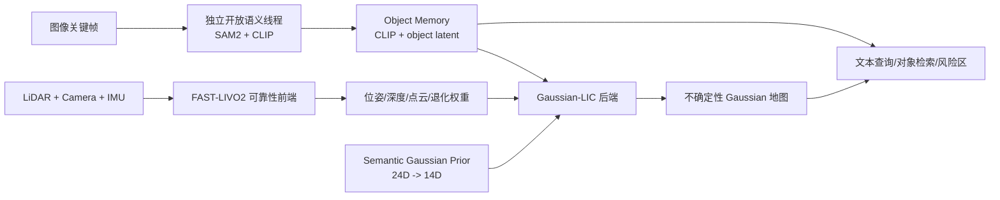

# 推荐研究方向与实施方案

> 唯一主线：**面向退化环境的 LIC 多源融合 SLAM、实时 3D Gaussian Splatting 与开放词汇对象语义地图**

## 1. 选题定位

### 1.1 建议论文题目

中文题目：

> **面向退化环境的多源融合开放词汇语义 3D Gaussian Splatting SLAM**

英文题目：

> **Degradation-Aware Multi-Sensor SLAM with Open-Vocabulary Semantic Gaussian Mapping**

工程简称继续使用 `OV-SG-LIC2`。这里的 LIC 明确指 LiDAR-Inertial-Camera，
前端基线固定为 `FAST-LIVO2`，3DGS 参考后端固定为官方
`Coco-LIC + Gaussian-LIC` 链路，不再回退到 FAST-LIO2，也不再新写一套
与官方实现脱离的高斯后端。

### 1.2 研究背景

传统 LiDAR-视觉-惯性 SLAM 主要输出稀疏点云、体素地图或稠密几何，能够服务定位，
但难以同时提供照片级渲染、对象级理解和开放词汇查询。3D Gaussian Splatting
提供了显式、可微、可实时渲染的场景表示，适合成为机器人长期使用的统一地图载体；
但现有 3DGS-SLAM 仍存在三个关键缺口：

1. 多数系统默认传感器观测长期可靠，对弱纹理、强光、运动模糊、LiDAR 几何退化和
   动态干扰缺少显式可靠性建模。
2. 高质量 Gaussian 优化通常需要较多迭代，前端能实时并不等于后端能持续实时，
   单卡加入开放语义后资源竞争更加明显。
3. 像素级语义或封闭类别标签难以支持未知对象、自然语言检索、跨帧对象记忆和
   后续对象级回环。

因此，本选题不是简单拼接“SLAM + 3DGS + CLIP”，而是研究：

> 如何在退化和动态环境中，以可靠性约束的 LIC 前端持续提供位姿与观测，
> 以不确定性和前馈先验约束的 3DGS 后端构建实时地图，并在不破坏几何与渲染质量的
> 前提下形成可查询、可关联、可长期维护的开放词汇对象地图。

### 1.3 研究价值

- **定位层**：让多传感器系统在部分观测长期退化时仍保持可观和稳定。
- **建图层**：将“退化权重”从日志指标推进为 Gaussian 更新与地图不确定性的显式依据。
- **效率层**：用轻量 Semantic Gaussian Prior 减少新增 Gaussian 的优化步数。
- **语义层**：用对象内存代替逐 Gaussian 存储高维 CLIP，控制显存并支持开放词汇查询。
- **论文层**：三个科学问题相互连接，但分别有独立模型、实验和消融，可支撑硕士论文三章。

## 2. 核心科学问题

### 2.1 退化环境中的多源观测可靠性如何统一建模

视觉、LiDAR 和 IMU 的退化形式不同，不能只用单一残差阈值。当前工程已经输出
视觉、LiDAR、IMU 和融合退化指标，下一步应将其从经验权重升级为带时间连续性、
置信下界和长期退化恢复机制的可靠性估计。

对传感器 \(s\) 在时刻 \(k\) 的有效信息矩阵定义为：

\[
\mathbf{\Omega}_{s,k}^{eff}
=w_s^{sensor}w_{s,k}^{semantic}\mathbf{\Omega}_{s,k},
\]

\[
E(\mathbf{x})=
\sum_{s\in\{L,C,I\}}\sum_k
\rho\!\left(
\mathbf r_{s,k}^{T}\mathbf{\Omega}_{s,k}^{eff}\mathbf r_{s,k}
\right).
\]

其中 `sensor weight` 来自几何、图像、运动与时序质量；`semantic weight`
只对动态或不可靠对象区域作用。所有权重必须保留正下界，长期退化时还要依靠 IMU
传播、边缘化先验、可观方向更新和恢复迟滞维持系统稳定，不能把全部传感器同时降到零。

### 2.2 如何构建带不确定性且可实时优化的 Gaussian 地图

当前退化权重已经能够影响 Gaussian 外观损失、点保留、opacity 和地图容量，
但尚不是完整的概率地图。论文级版本应为每个 Gaussian 维护：

\[
G_i=(\mu_i,\Sigma_i,c_i,\alpha_i,z_i,U_i),
\]

其中 \(U_i\) 表示位姿、深度、颜色和对象关联的不确定性摘要。观测可靠性应影响：

- 均值和协方差更新增益；
- 颜色/外观损失权重；
- opacity 的置信累积；
- densification、pruning 和点保留；
- 关键帧选择与局部优化预算。

效率增强采用轻量前馈 Prior：

\[
x_i=[\tanh(\mu_i/50),RGB_i,\log(1+d_i),z_i^{obj},C_i]\in\mathbb R^{24},
\]

\[
\Delta_\theta(x_i)=
[\Delta\mu_3,\Delta\log s_3,q_4,\Delta c_3,
\Delta\operatorname{logit}\alpha]\in\mathbb R^{14}.
\]

Prior 只初始化新增 Gaussian，随后仍由 Gaussian-LIC 做少量残差优化；
它不能替代几何约束，也不能让语义直接支配椭球参数。

### 2.3 如何形成开放词汇、对象级、时序一致的语义地图

CLIP 只用于自然语言查询，不作为 Gaussian Prior 的 object latent。
地图采用双层表示：

1. **Gaussian 层**：保存几何、颜色、opacity、紧凑语义索引和不确定性。
2. **Object Memory 层**：保存对象 ID、CLIP 特征、16 维 object latent、
   观测次数、置信度、时间跨度、包围区域和动态风险。

逐帧 SAM2/CLIP 输出通过时间戳、投影和对象关联绑定到新增 Gaussian。
densification 和 pruning 必须同步维护语义索引。开放词汇查询流程为：

\[
\text{text}\rightarrow \text{CLIP query}
\rightarrow \text{Object Memory}
\rightarrow \text{Gaussian index set}
\rightarrow \text{3D highlight/retrieval}.
\]

## 3. 硕士论文的三个主要创新点

### 3.1 第一章：退化感知的 LIC 多源融合前端

研究内容：

- 视觉：纹理、梯度、曝光、跟踪内点、重投影残差和模糊度；
- LiDAR：局部协方差谱、平面/线结构、有效约束数和 ICP 残差；
- IMU：激励水平、偏置稳定性和传播不确定性；
- 语义：动态目标概率、区域歧义和语义置信度；
- 时间：同步误差、发布延迟和权重平滑/迟滞。

预期创新：

> 提出具有长期退化保护和语义风险调制的多源可靠性估计，使可靠性同时作用于前端
> 因子/残差和后端观测，而不是只作为可视化日志。

主要实验：正常/退化序列 ATE、RPE、失败率、恢复时间、权重曲线和各因素消融。

### 3.2 第二章：不确定性与前馈先验增强的实时 3DGS 地图

研究内容：

- 将前端位姿、深度、颜色和退化置信传播到 Gaussian；
- 分离外观损失权重、几何容量和 opacity/保留策略，避免三重降权欠拟合；
- 设计可观测性与不确定性驱动的 densification/pruning；
- 用 nuScenes 预训练 + R3LIVE 100-step Teacher 蒸馏轻量 Prior；
- 用 20/30/40/100-step 曲线寻找质量与实时性的 Pareto 点。

预期创新：

> 构建可靠性驱动的概率式 Gaussian 更新，并通过前馈初值显著减少后端迭代，
> 在跨序列测试中保持新视角质量。

首轮 held-out `degenerate_seq_02` 已得到：

- Prior 20-step：`30.56 ms/frame`，`32.73 FPS`；
- Baseline 100-step：`84.71 ms/frame`，`11.80 FPS`；
- 加速：`2.77x`；
- 1070 个公共新视角帧：PSNR `-0.073 dB`、SSIM `+0.0163`、
  LPIPS `-0.01095`。

当前不足是训练视角 PSNR 仍低于 100-step baseline，故不能宣称全指标无损。

### 3.3 第三章：开放词汇对象级 Gaussian 地图与时序关联

研究内容：

- 0.5–2 Hz 独立语义线程；
- 对象内存的创建、更新、合并、衰减和查询；
- Gaussian-to-Object 概率关联；
- 动态对象风险区和静态对象长期记忆；
- 对象级重定位/回环作为增强目标。

预期创新：

> 在不向每个 Gaussian 复制高维 CLIP 的前提下，实现开放词汇查询、跨帧对象记忆和
> 可扩展的对象级地图，并研究语义关联置信对地图更新和回环的作用。

## 4. 总体系统



### 4.1 三线程边界

- **前端线程**：连续 LIC 里程计和退化检测，不能等待语义。
- **后端线程**：接收 `/image_for_gs`、`/depth_for_gs`、`/pose_for_gs`、
  `/points_for_gs` 和权重消息，执行 Gaussian 更新。
- **语义线程**：0.5 Hz 默认、1 Hz 增强、2 Hz 压力测试；队列只保留最新帧，
  不形成反压。

第一版语义不直接进入 Gaussian loss、opacity、densification 或 pruning。
只有在对象关联和不确定性验证完成后，才逐项打开语义耦合并做独立消融。

### 4.2 固定相机与接口契约

R3LIVE 主链固定使用：

```text
FAST-LIVO2 backend_contract
K = (431.71205, 431.70855, 320.3404, 259.1696)
Gaussian-LIC r3live_paper / r3live_prior / r3live_teacher
depth_completion = false
```

`fastlivo2_paper.yaml` 中约 646 的内参仅用于旧链复现，禁止与
`backend_contract` 组合。所有性能结论必须同时记录数据集、内参、处理帧数、
优化步数、随机种子和语义调度方式。

## 5. Semantic Gaussian Prior 训练协议

### 5.1 两阶段训练

1. **nuScenes 预训练**：用 CAM_FRONT、LIDAR_TOP、标定、位姿、3D box 和局部
   LiDAR 协方差生成 24D→14D 监督。
2. **R3LIVE Teacher 蒸馏**：Prior 关闭、100-step Gaussian-LIC；通过持久
   candidate ID 对齐新增候选与最终 Gaussian，避免把最终参数泄漏回输入。
3. **在线 Student**：加载 TorchScript Prior，默认 20-step 残差优化。

### 5.2 防止数据泄漏

R3LIVE 禁止随机拆帧。当前固定协议：

- train：`hku_campus_seq_00 + degenerate_seq_01`；
- validation：`hku_park_00`；
- test：`degenerate_seq_02`；
- 测试序列不得生成或使用 Teacher 标签；
- 跨运行质量比较优先按 GT 图像哈希对齐公共源帧。

曾有 runner 将 Teacher 配置错误覆盖为 20-step。旧产物均标记
`INVALID_TEACHER_CONTRACT.txt`，正式模型只使用修复后的 100-step v2 数据。

## 6. 实验矩阵与评价指标

### 6.1 必做对照

| 组别 | Prior | 残差优化 | 语义 | 目的 |
|---|---|---:|---|---|
| B0 | 关闭 | 100 | 独立线程 | 高质量 baseline |
| B1 | 关闭 | 20 | 独立线程 | 验证单纯减步数的损失 |
| P0 | nuScenes only | 20 | 独立线程 | 预训练迁移能力 |
| P1 | R3LIVE 从零蒸馏 | 20 | 独立线程 | 蒸馏来源消融 |
| P2 | nuScenes + R3LIVE | 20 | 独立线程 | 主方法 |
| P3 | 主方法 | 30/40 | 独立线程 | Pareto 曲线 |

### 6.2 统一指标

- 定位：ATE、RPE、漂移率、失败率、恢复时间；
- 地图：PSNR、SSIM、LPIPS、深度误差、Gaussian 数量；
- 语义：对象关联准确率、查询 Recall@K、动态区 IoU、对象 ID 切换；
- 实时性：前端、后端、语义分别计时，Mapping ms/frame、端到端 FPS；
- 资源：GPU 均值/P95/峰值、显存、CPU、磁盘；
- 稳定性：ROS 丢帧、处理帧数、时间同步误差和重复运行方差。

若数据集没有外部真值，必须写“ATE/RPE 不可计算”，不得用跨运行轨迹差冒充真值误差。

## 7. 实施路线

### 7.1 阶段一：稳妥版闭环

- 冻结 FAST-LIVO2 + Gaussian-LIC 正确相机契约；
- 保持现有退化检测与权重路径不变；
- 三线程独立运行，语义不进入 Gaussian 优化；
- 完成对象内存、查询、高亮和索引一致性；
- 完成 Prior 20/30/40/100-step 跨序列消融。

### 7.2 阶段二：论文增强版

- 建立 per-Gaussian 不确定性状态；
- 将观测不确定性分别接入均值、协方差、opacity 和容量控制；
- 实现 Gaussian-to-Object 概率关联；
- 让语义风险只影响明确的动态区域，而不是全局降权；
- 在带真值数据集上完成 ATE/RPE 与画质联合验证。

### 7.3 阶段三：完整论文闭环

- 加入对象级重定位或回环；
- 做长期场景更新和对象生命周期管理；
- 完成多序列、跨场景和重复运行统计；
- 形成三个主章节及统一系统实验。

## 8. 当前完成状态

已完成：

- FAST-LIVO2 的 R3LIVE 配置、退化指标、权重和 3DGS packet；
- FAST-LIVO2 到 Gaussian-LIC 四路后端接口；
- 正确 K=431 相机契约和 headless 完整运行；
- Gaussian 语义索引随 densification/pruning 同步；
- 独立 0.5–2 Hz SAM2/CLIP 对象语义线程；
- Object Memory、文本查询、语义高亮和 ROS service；
- nuScenes-mini Prior 预训练；
- R3LIVE 100-step Teacher 无泄漏导出与蒸馏；
- held-out Prior 20-step 对 100-step baseline 的首轮验证。

尚未完成：

- 论文级 per-Gaussian 不确定性更新；
- 语义参与前端因子图的严格实现与消融；
- 20/30/40-step Pareto 完整曲线；
- 带外部真值的 ATE/RPE 联合实验；
- 对象级回环和长期地图更新。

## 9. 风险与边界

1. 单 GPU 三线程不存在“软件独立即资源独立”，必须报告 GPU 竞争。
2. 语义不能在第一版同时影响外观、opacity、点保留和 pruning，否则容易欠拟合。
3. Prior 只能减少初始化后的优化负担，不能替代几何约束和不确定性建模。
4. R3LIVE 适合系统运行和蒸馏，但不适合从零训练通用 Prior。
5. 当前首轮 test 只有一个 held-out 序列，正式论文至少需要多折或新增公开数据集。
6. 所有结论以 `实验记录与对比结果.md` 的编号实验和有效性标记为准。

## 10. 近期执行顺序

1. 跑 Prior 20/30/40-step 与无 Prior 20/100-step 五组严格对照。
2. 用低学习率、冻结前层和 source-balanced sampling 重做蒸馏消融。
3. 引入带真值的 LIC 数据集，补 ATE/RPE。
4. 设计 per-Gaussian 不确定性字段和更新方程，先只作用均值/协方差。
5. 完成 Gaussian-to-Object 概率关联，再逐项测试语义风险对前端和后端的作用。

---

文档维护规则：本文件只维护这一条主线的研究问题、创新点、边界和实施路线；
工程路径与命令统一写入 `工程架构与实验运行指南.md`，所有数值结果统一写入
`实验记录与对比结果.md`。
